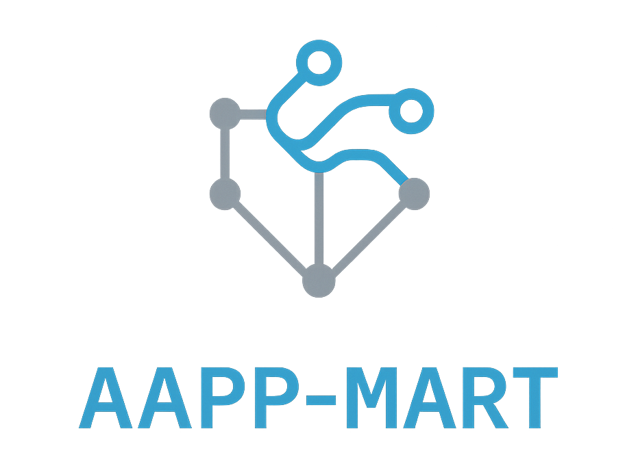

# AAPP-MART

<p align="center">

</p>

**Predict. Simulate. Secure.**

An AI‑Autonomus Attack Path Prediction & Multi-Agent Red Team Simulation Engine designed for enterprise‑grade security assessment.  
AAPP‑MART helps organizations anticipate attack paths and validate defenses using AI‑Autonomous Attack Path Prediction.  

**Official Website:** [https://secwexen.github.io/aapp-mart/](https://secwexen.github.io/aapp-mart/)

[](https://github.com/secwexen/aapp-mart/actions/workflows/ci.yml)
[](https://codecov.io/gh/secwexen/aapp-mart)
[](https://github.com/secwexen/aapp-mart/releases)
[](https://github.com/secwexen/aapp-mart/blob/main/LICENSE)

## About

**AAPP‑MART | AI‑Autonomous Attack Path Prediction & Multi‑Agent Red Team Simulation Engine** is an open‑source Python security engine designed for offensive security research, adversarial modeling, and automated risk assessment. It combines AI‑powered attack‑path prediction with autonomous multi‑agent red‑team simulation to model how real attackers navigate an environment and to reveal actionable, data‑driven security insights.

Unlike traditional static vulnerability scanners or manual penetration testing, AAPP‑MART uses predictive analytics, graph‑based threat modeling, and autonomous adversarial behavior to deliver continuous and realistic security evaluation. Its architecture helps defenders anticipate attack strategies, validate defensive controls, and understand real‑world risk through repeatable, scalable, and intelligence‑driven simulations.

## Overview

Modern infrastructures are too dynamic and interconnected for traditional security testing to keep pace. 
Static scanners and predefined BAS playbooks often fail to capture how real attackers move across complex environments. 

AAPP‑MART addresses this gap by combining predictive AI, AI-driven threat modeling, cyber attack surface prediction, 
and autonomous adversarial simulation to evaluate an environment’s real exposure. The engine models attacker behavior, 
forecasts potential attack paths, and simulates multi-agent adversarial activity to provide proactive, 
intelligence-driven insights into organizational security posture.

## How AAPP-MART Works

1. **AAPP (AI-Autonomous Attack Path Prediction)**  
   Evaluates assets, configurations, permissions, and vulnerabilities to predict probable attacker paths.

   **AI Engine:**
   - Decision Logic: Rule-based / ML / Hybrid (per module).  
   - Learning: Offline or deterministic scoring  
   - Decision Factors: Exploitability, exposure, privilege, asset criticality

2. **MART (Multi-Agent Red Team Simulation Engine)**  
   Autonomous agents simulate realistic adversary actions:  
   Reconnaissance, Exploitation, Lateral Movement, Privilege Escalation, Persistence, Reporting 

3. **CORE Orchestration Engine**  
   Coordinates AAPP & MART, maintains a global knowledge graph, executes simulations, and produces structured risk reports.

**Example Attack Flow:** 
```bash
[User Credential] → [Phishing/Exploit] → [Initial Access] → [Lateral Movement] → [Privilege Escalation] → [Critical Asset Compromise]
```

## Architecture Diagram

AAPP-MART is an AI-Autonomous cybersecurity simulation engine designed for predictive AI-Autonomous Attack Path Prediction & Multi-Agent Red Team Simulation Engine experimentation.

The system models infrastructure assets, vulnerabilities, and relationships as an attack graph that serves as the analytical foundation for the prediction engine and autonomous agent system. These components simulate adversarial behavior and forecast potential attack paths across complex environments.

## Features

- AI-Autonomous Attack Path Prediction
- Multi-Agent Red Team Simulation Engine
- Graph-based threat modeling and attack graph analysis
- MITRE ATT&CK aligned adversary behavior modeling
- Risk-based security posture analysis
- ML-assisted vulnerability prioritization
- Scalable adversarial simulation architecture
- Extensible modular plugin system
- Python-based open-source cybersecurity Engine

## Conceptual Usage Example (Planned API)

This example reflects the intended public API design:

```python
import os
from aapp_mart.core.orchestrator import AAPP_MART

# Initialize the engine with a target IP or hostname
engine = AAPP_MART(target="192.168.1.10")

# Run simulation
engine.run()

# Retrieve the generated attack-path report
report = engine.get_report()

# Print a concise summary of the predicted attack paths
report.export(format="json", path="./logs/attack-path/attack_report.json")
```

Core orchestration modules are currently under development.  

See [API Reference](docs/reference/api_reference.md) and [System Architecture](docs/architecture.md) for interface details and system structure.  

## Demo

Experience how **AAPP-MART simulates real-world cyber attacks and predicts attack paths using multi-agent red team simulation engine**.

This interactive demo includes:
- Shows predicted attack paths 
- Simulates red-team agent behavior 
- Generates risk scores and MITRE ATT&CK technique mappings 

### Run the Demo (Google Colab)

**Launch the interactive demo here:**
[Attack Path Demo Notebook on Google Colab](https://colab.research.google.com/github/secwexen/aapp-mart/blob/main/demo/aapp_mart_attack_path_demo.ipynb)

No installation required — run directly in your browser.

## Legal & Authorized Use

AAPP-MART is intended solely for authorized security assessment, defensive threat modeling, 
and controlled adversary simulation within environments where explicit permission has been granted.

The system is designed for non-destructive analysis and does not support uncontrolled exploitation. 
Users are responsible for ensuring lawful and policy-compliant usage.

## Why AAPP-MART?

AAPP-MART stands out from traditional security tools in its approach:

- **Traditional scanners** → static, reactive, often limited to known vulnerabilities.
- **BAS (Breach & Attack Simulation) tools** → rely on predefined playbooks and limited scenarios.
- **AAPP-MART** → predictive, autonomous, and adaptive: forecasts attack paths and executes intelligent multi-agent simulations.

By combining **AI-Autonomous attack path prediction** with **Multi-Red Team Simulation Engine**, AAPP-MART provides organizations with a forward-looking security posture, not just reactive alerts.

## Why This Project Exists

AAPP-MART was created to help security teams anticipate and simulate modern cyber-attacks before damage occurs.  
Unlike traditional tools that detect incidents after they happen, it predicts attacker behavior and models potential attack paths proactively.

## Installation

AAPP‑MART is currently under active development.

### Supported Operating Systems

- Windows 10 / 11  
- Linux (Ubuntu 22.04+ / Debian 11+ / other Debian-based distributions)  
- macOS (Intel & Apple Silicon)

### Python Requirements

- Python **3.11+**  
- pip 23+  
- Virtual environment recommended

## Quick Start

```bash
# Clone repo
git clone https://github.com/secwexen/aapp-mart.git
cd aapp-mart

# Create virtual environment
python -m venv venv
source venv/bin/activate  # Linux/Mac
venv\Scripts\activate     # Windows

# Install dependencies
pip install -r requirements.txt

# Install dev dependencies
pip install -r dev-requirements.txt
```

For full details, refer to the [Quick Start](docs/guides/quickstart.md) file.

## Use Cases

AAPP-MART is designed for:

| Audience | How AAPP‑MART Helps |
|----------|---------------------|
| Security Researchers | Simulate adversarial behavior, test hypotheses, model attacker strategies |
| Enterprise Security Teams | Predict attack paths, validate controls, strengthen defenses |
| Academia | Study AI-driven threat modeling and autonomous red teaming |
| Developers | Integrate predictive security insights into CI/CD or custom workflows |

## Docs & Resources

Detailed guides and references are also available in the repository:

- [Wiki — Full Documentation](https://github.com/secwexen/aapp-mart/wiki)
- [Repository Structure & System Components](docs/architecture.md)
- [API Reference](docs/reference/api_reference.md)
- [Risk Model](docs/concepts/risk_model.md)
- [Deployment Guide](docs/guides/deployment.md)
- [Full Installation Guide](docs/guides/installation.md)
- [Quick Start](docs/guides/quickstart.md)
- [Examples](docs/examples.md)
- [Roadmap & Milestones](ROADMAP.md)
- [Contributing Guidelines](CONTRIBUTING.md)
- [Changelog](CHANGELOG.md)
- [Security Policy](SECURITY.md)

## License

Copyright © 2026 secwexen.

This project is licensed under the Apache License, Version 2.0.  
See the [LICENSE](LICENSE) file for full details.  

## Contributing

Contributions are welcome!

### Contributing Workflow (Summary)

- Fork the repository and create a feature or fix branch (e.g. `feature/your-feature` or `fix/bug-name`).
- Make your changes and add relevant tests.
- Ensure all tests pass (`pytest`) and code style checks (e.g. `make lint`).
- Open a pull request referencing related issues/discussion when possible.
- All PRs must pass CI checks before merging.

Please open an issue before submitting major changes or new features.

See [CONTRIBUTING.md](CONTRIBUTING.md) for detailed contribution guidelines.

## Roadmap

The development of **AAPP-MART** follows a structured roadmap focused on improving attack path prediction, Multi-Red Team Simulation Engine, and security research capabilities.

Planned improvements include:

- advanced attack graph generation
- improved AI-based attack path prediction
- expanded MART offensive agents
- enhanced risk scoring and reporting
- improved visualization and dashboards
- plugin ecosystem for custom modules and agents
- distributed simulation support

For the full roadmap and upcoming features, see [Roadmap.md](docs/research/roadmap.md).

The roadmap evolves over time based on community feedback, research outcomes, and contributor proposals. Contributions and suggestions are welcome.

## Development Status

Active development open source project. Core implementation is still in progress.   

This repository provides the foundational architecture, core interfaces, and initial logic of the AAPP-MART engine.

Advanced prediction models, autonomous agent behaviors, and controlled simulation capabilities are being implemented progressively.

## Community

- Check out [Issues](https://github.com/secwexen/aapp-mart/issues) for tasks and ideas.  
- Join [Discussions](https://github.com/secwexen/aapp-mart/discussions) to share feedback and proposals.  
- ⭐ **Found AAPP-MART repository useful? Give us a star and help grow the community!**  
- 🤝 **Contribute code, documentation, or testing — see [CONTRIBUTING.md](CONTRIBUTING.md) for details.**  

## Security

If you discover a security vulnerability, please follow our responsible disclosure process.

[Read SECURITY.md](SECURITY.md) for instructions on reporting issues securely. 

## External References

- MITRE ATT&CK Framework — https://attack.mitre.org  
- NIST Cybersecurity Framework — https://www.nist.gov/cyberframework
- CIS Benchmarks — https://www.cisecurity.org/cis-benchmarks  
- SANS Institute — https://www.sans.org  
- OWASP Security Projects — https://owasp.org  
- Microsoft Security Research — https://www.microsoft.com/en-us/security/blog/
- Kaspersky Cybermap (Live Threat Map) — https://cybermap.kaspersky.com
