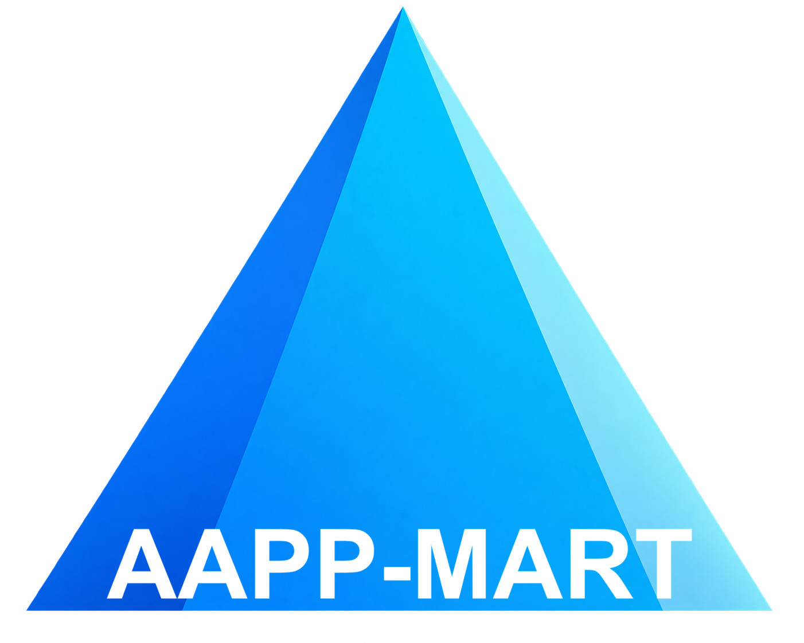

# AAPP-MART

<p align="center">

</p>

[](https://github.com/secwexen/aapp-mart/actions/workflows/ci.yml)
[](https://github.com/secwexen/aapp-mart/releases)
[](https://github.com/secwexen/aapp-mart/blob/main/LICENSE)

## About

**AAPP‑MART** (AI‑Powered Autonomous Attack Path Prediction & Multi‑Agent Red Team Simulation Engine) is a security engine for **offensive security**, **adversary emulation**, **security validation**, **threat modeling**, and **risk assessment**. It combines **AI‑Powered Autonomous Attack Path Prediction** with **Multi‑Agent Red Team Simulation** to model how real attackers navigate an environment and to reveal actionable, data‑driven security insights.

Unlike traditional static vulnerability scanners or manual penetration testing, AAPP‑MART uses predictive analytics, graph‑based threat modeling, and autonomous adversarial behavior to deliver continuous and realistic security evaluation. Its architecture helps defenders anticipate attack strategies, validate defensive controls, and understand real‑world risk through repeatable, scalable, and intelligence‑driven simulations. 

The system generates structured **attack-path reports**, **MITRE ATT&CK mapped insights**, and **risk scoring outputs** to support SOC operations, detection engineering, and continuous security improvement.

## Why AAPP-MART?

AAPP-MART stands out from traditional security tools in its approach:

- Traditional scanners → static, reactive, often limited to known vulnerabilities.
- Breach & Attack Simulation (BAS) tools → rely on predefined playbooks and limited scenarios.
- AAPP-MART → predictive, autonomous, and adaptive: forecasts attack paths and executes intelligent multi-agent simulations.

By combining AI-Powered Autonomous Attack Path Prediction with Multi-Agent Red Team Simulation, AAPP-MART provides organizations with a forward-looking security posture rather than just reactive alerts.

## Use Cases

- AI-Powered Autonomous Attack Path Prediction (AAPP)  
- Multi-Agent Red Team Simulation (MART)  
- Attack Surface & Lateral Movement Modeling  
- MITRE ATT&CK Aligned Threat Simulation  
- Vulnerability Prioritization & Risk Scoring  
- Continuous Security Assessment  
- Attack Simulation Research

## How it Works

### 1. AI-Powered Autonomous Attack Path Prediction (AAPP)

Evaluates assets, configurations, permissions, and vulnerabilities to predict probable attacker paths.

### 2. Multi-Agent Red Team Simulation (MART)

Autonomous agents simulate realistic adversary actions:

- Reconnaissance  
- Exploitation  
- Lateral Movement  
- Privilege Escalation  
- Persistence  
- Reporting

### 3. Core Orchestration (ENGINE)

Coordinates AAPP & MART, maintains a global knowledge graph, executes simulations, and produces structured risk reports.

## Architecture

The system is architected around three primary subsystems:

- AI-Powered Autonomous Attack Path Prediction (AAPP)  
- Multi-Agent Red Team Simulation (MART)  
- Core Orchestration (ENGINE)

These subsystems operate in a tightly integrated manner through a shared attack graph (knowledge graph), enabling coordinated attack modeling, adversarial simulation, and unified risk analysis across the engine.

## Legal & Authorized Use Only

AAPP-MART is intended solely for offensive security, adversary emulation, security validation, threat modeling, and risk assessment within environments where explicit permission has been granted.

Users are fully responsible for ensuring compliance with all applicable laws, regulations, and organizational policies when operating this system.

Unauthorized use of this system is strictly prohibited and may violate applicable laws and regulations.

## Legal Disclaimer

The developers and contributors of this project assume no responsibility or liability for misuse, damage, or legal consequences arising from the use of this software.

This software is provided “as is” without warranty of any kind, express or implied.

## Who is this for

- CISOs, InfoSec managers, and executive stakeholders seeking actionable security intelligence  
- Security, engineering, and risk teams aiming to proactively assess and improve cyber resilience  
- Internal/External red, blue, and purple teams requiring realistic, repeatable adversary emulation  
- Organizations subject to regulatory or compliance mandates (MITRE ATT&CK, NIST, CIS, PCI DSS, ISO 27001, etc.)

## Features

- AI-Powered Autonomous Attack Path Prediction (AAPP)  
- Multi-Agent Red Team Simulation (MART)  
- Core Orchestration (ENGINE)  
- Graph-Based Threat Modeling
- MITRE ATT&CK Aligned Adversary Behavior
- Risk-Based Security Posture Analysis  
- ML-Assisted Vulnerability Prioritization

## Demo

```bash
python demo/advanced_attack_simulation.py
```

### Demo Output

```text
=== AAPP-MART — AI-Powered Autonomous Attack Path Prediction & Multi-Agent Red Team Simulation Engine ===

[*] Initial Entry Point Acquired: 10.10.20.15 (WORKSTATION-01)
[+] [Agent-Recon  ] Reconnaissance       | MITRE: T1595 | Severity: LOW      | Duration: 1.4s | Active scanning detected
[+] [Agent-Access ] Phishing             | MITRE: T1566 | Severity: MEDIUM   | Duration: 2.1s | Credential harvesting attempt
[+] [Agent-Access ] Initial Access       | MITRE: T1078 | Severity: HIGH     | Duration: 1.8s | Valid account abuse
[+] [Agent-Exploit] Privilege Escalation | MITRE: T1068 | Severity: CRITICAL | Duration: 2.7s | Kernel privilege escalation simulated
[+] [Agent-Pivot  ] Lateral Movement     | MITRE: T1021 | Severity: HIGH     | Duration: 3.2s | Remote service pivoting to 10.10.20.45
[✓] Simulation Completed Successfully

=== Comprehensive Risk Summary ===

[*] Target IP (Initial Entry)   : 10.10.20.15 (WORKSTATION-01)
[*] Risk Score                  : 9.1/10 (CRITICAL)
[*] Duration                    : 11.2s
[*] Simulated Step Count        : 5 Stages
[*] Compromised Assets          : 4 Systems (1 Isolated)
[*] Generated At                : 2026-01-01T05:30:03.123456+00:00

Affected Critical Assets:
[!] WORKSTATION-01       | IP: 10.10.20.15 | Type: Endpoint     | Severity: HIGH     | Status: Compromised (Initial Vector)
[!] FILE-SERVER-01       | IP: 10.10.20.2  | Type: Storage      | Severity: HIGH     | Status: Isolated (Domain Admin)
[!] DOMAIN-CONTROLLER-01 | IP: 10.10.20.45 | Type: Identity/AD  | Severity: CRITICAL | Status: Compromised (Data Exfiltrated)
[!] HR-DB-01             | IP: 10.10.20.12 | Type: SQL Database | Severity: CRITICAL | Status: Compromised (Attack Blocked)

[+] Report Exported: /home/user/aapp-mart/logs/attack-path/attack_path_report.json
```

See the [Attack Path Simulation Report](demo/reports/attack_report.json) json file.

> [!NOTE]
> This IP/hostname is an example target.

## Installation

### Supported Operating Systems

- Linux (primary, production & deployment recommended)  
- Windows (WSL2 + Docker required for full compatibility)  
- macOS (Docker or native development supported)

### Requirements

- Python 3.11+
- Docker
- Kubernetes (for deployment)
- YAML / JSON-based configuration ecosystem

## Quick Start

```bash
# Clone repository
git clone https://github.com/secwexen/aapp-mart.git
cd aapp-mart

# Create virtual environment
python -m venv venv
source venv/bin/activate  # Linux/Mac
venv\Scripts\activate     # Windows

# Install dependencies
pip install -r requirements.txt

# Install dev dependencies
pip install -r requirements-dev.txt
```

For full details, refer to the [Quick Start](docs/getting-started/quickstart.md) file.

## Documentation

- [Quick Start](docs/getting-started/quickstart.md)  
- [Installation Guide](docs/getting-started/installation.md)  
- [API Reference](docs/reference/api-reference.md)  
- [Deployment Guide](docs/guides/deployment.md)  
- [Security Policy](SECURITY.md)

## License

Copyright © 2026 secwexen.

This project is licensed under the Apache-2.0 License.  
See the [LICENSE](LICENSE) file for full details.

## Contributing

Contributions and suggestions are welcome!

- Fork the repository and create a feature or fix branch (e.g. `feature/your-feature`, `fix/bug-name`, `docs/update-readme`, `chore/dependency-update`).
- Make your changes and add relevant tests.
- Use clear commit messages (e.g. Conventional Commits: `feat:`, `fix:`, `docs:`, `refactor:`).
- Ensure all tests pass (`pytest`) and code style checks (e.g. `make lint`).
- Open a pull request referencing related issues when possible.
- All PRs must pass CI checks before merging.

Please open an issue before submitting major changes or new features.

See [CONTRIBUTING](CONTRIBUTING.md) for detailed contribution guidelines.

## Roadmap

Planned improvements include:

- improved AI-Powered Attack Path Prediction
- path-aware risk scoring based on simulated attack chains
- optional visualization layer for simulation outputs
- plugin ecosystem for custom modules and agents
- distributed simulation support

For the full roadmap and upcoming features, see [Roadmap](ROADMAP.md).

## Security

If you discover a security vulnerability, please follow our responsible disclosure process.

See [SECURITY](SECURITY.md) for instructions on reporting issues securely.